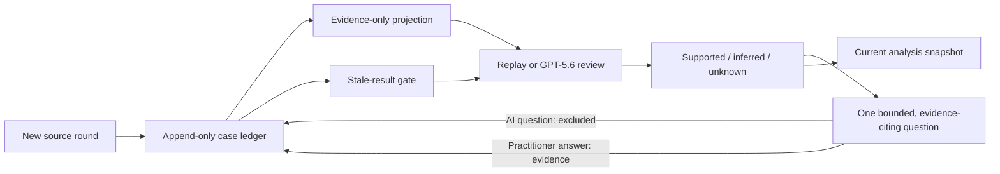

# ObserveOS — The Self-Improving Clinic Operating System

> The breakthrough was not a more fluent answer. It was a governed system that keeps reports, observations, inferences, and unknowns separate—and prevents stale analysis from entering the reviewed record.

ObserveOS is a synthetic-only Build Week prototype of a whole-practice operating system. Its runnable core is the **CaseAgent Reflection Loop**: one fictional case receives multiple rounds of new information while source roles, inferences, unknowns, practitioner answers, and analysis freshness remain traceable.

“Self-improving” is human-governed, not autonomous self-modification. Practitioner answers and later evidence change the next governed run; proposed rules, gold cases, and regression tests enter the formal contract only after human review.

The public repository is intentionally narrow enough to inspect in minutes. It implements the evidence-governance kernel built during OpenAI Build Week; the broader private ObserveOS modules provide product lineage and are not hidden judge dependencies.

## What judges can run

- A local browser app with no third-party runtime packages.
- A four-round fictional case that behaves like a real longitudinal workflow: provide information, review an analysis, add human evidence, and review again.
- A three-case deterministic governance corpus: the longitudinal workflow, a report-versus-observation conflict, and later evidence that weakens an earlier inference.
- A deterministic Replay mode that works without Codex access or model cost.
- An optional live GPT-5.6 mode that reuses an existing Codex **ChatGPT sign-in**—no OpenAI API key is required.
- An append-only event ledger with a verifiable, tamper-evident hash chain.
- An evidence projection that excludes AI questions and preserves practitioner-answer provenance.
- A save gate that stores the current normalized analysis without a second model call.
- Forty-seven automated tests, a four-round gold replay, a three-case governance corpus, a privacy audit, and JavaScript syntax verification.

## 90-second judge route

1. Start the app with `START_DEMO.cmd` on Windows, or run `python app.py --open-browser`.
2. Choose **90-second judge tour**. Leave **Replay** selected and choose **Run evidence replay**.
3. In the deterministic replay, notice that the initial client report remains a report rather than being silently upgraded into a practitioner observation.
4. Inspect the bounded reflection question: it cites existing evidence events, but the question itself remains outside evidence.
5. Choose **Use demo answer**, then **Add answer as evidence**.
6. The previous analysis becomes stale. Run Replay again.
7. Continue through the practitioner observation, intervention/retest, and next-day follow-up rounds.
8. Inspect **What counts as evidence?** AI questions remain excluded; practitioner answers retain provenance.
9. Save the current analysis only when the gate is ready. Saving does not trigger another model call.

To test the live route, sign into Codex once with `codex login`, select **Codex live**, and run the same workflow. The app checks the existing Codex login; it never asks for or stores an API key.

## Three-case synthetic governance corpus

The browser tour uses the full four-round case. Two additional, fully fictional conformance cases make the hardest governance transitions directly testable without exposing private case material:

- **Source-role conflict:** a client report and practitioner observation appear to disagree, but remain separate until practitioner adjudication.
- **Inference revision:** a short immediate response supports only a tentative inference; later non-replication makes the earlier review stale and weakens that inference.

Run all three cases with no account, model call, or package install:

```bash
python scripts/run_governance_corpus.py
```

The deterministic result is 3 cases, 8 source rounds, 15 analyses, 7 practitioner answers, 3 current-analysis snapshots saved without regeneration, and 3 verified event chains. See [docs/JUDGE_TOUR.md](docs/JUDGE_TOUR.md) for the shortest review path.

## Evidence contract

| Layer | Meaning | Can become formal case truth? |
|---|---|---|
| Source | What a person or governed input actually provided | Yes, with provenance |
| Observation | What the practitioner actually recorded | Yes, with provenance |
| Inference | A bounded interpretation derived from cited sources | Only after human review |
| Unknown | Not observed, not tested, or not remembered | Yes—as an explicit unknown |
| AI question | A recall or reflection prompt | No; interaction history only |
| Practitioner answer | The expert’s response to a question | Yes, as new evidence |

Supported findings and inferences must cite existing evidence event IDs. Citation validation confirms that the referenced IDs exist; semantic support remains human-reviewed. A reflection question may guide recall, but it stays in interaction history and never enters the evidence projection. When new source material or a practitioner answer arrives, the prior analysis becomes stale. The save gate stores the current normalized analysis without a second model call.



The detailed contract is in [docs/EVIDENCE_CONTRACT.md](docs/EVIDENCE_CONTRACT.md).

## Why GPT-5.6 mattered

Earlier work could produce strong bounded outputs when the source set and prompt were already clean. The qualitative shift was architectural: GPT-5.6 helped turn recurring failure modes and practitioner feedback into explicit evidence categories, save gates, gold-case expectations, and human-reviewed regression tests.

During Build Week, Codex and GPT-5.6 were used to extract that governing idea from the broader private workflow and build a new, independently runnable public kernel: the local app, event model, evidence projection, Replay/Codex paths, schema gates, synthetic gold evaluation, and release checks.

The development contribution and verifiable Build Week session evidence are described in [docs/BUILD_WEEK_EVIDENCE.md](docs/BUILD_WEEK_EVIDENCE.md).

## Seven-model internal benchmark

The latest fully comparable private evaluation ran seven model routes through the same seven strict, text-only Gold cases: 49 independent, turn-by-turn chats and 462 canonical model calls. The two newest cases in the current nine-case private corpus were added later and are not included in these scores.

| Model route | Average /100 | Range | Sanitized practitioner assessment |
|---|---:|---:|---|
| Sol Medium | **91.43** | 87–95 | Most stable evidence boundaries and long-context revision; still requires human review. |
| Terra Medium | **88.57** | 85–92 | Strong and consistent; effectively tied with Luna Medium at this benchmark's resolution. |
| Luna Medium | **88.43** | 78–93 | Strong, concise, and source-faithful, with fewer proactive questions in some cases. |
| Luna XHigh | **86.14** | 75–93 | Strong on shorter cases, but less stable than Medium in the longest case. |
| Kimi K3 | **68.29** | 58–78 | Found the main thread but needed intensive supervision for invented schedules and mechanism overreach. |
| GLM-5.2 Max | **62.00** | 49–70 | Frequently promoted working hypotheses into causal explanations. |
| DeepSeek V4 Pro Thinking | **57.14** | 42–65 | Highest correction burden and strongest long-context error recurrence. |

These are internal workflow-rubric scores, not clinical efficacy scores or a claim about every model capability. See the [full sanitized benchmark table and methodology](docs/SEVEN_MODEL_BENCHMARK.md).

## Whole-system vision, separate truth layers

ObserveOS can coordinate intake, governed transcription, case reasoning, source-separated knowledge, operations readback, websites and campaigns, and content production. It does **not** merge them into one giant truth bucket. Each domain keeps its own formal source and confirmation boundary; the public prototype implements the reflection loop that governs how evidence crosses into a case output.

The broader private CaseAgent workflow also maintains clinical decision logic base v3.5.1, a versioned and practitioner-authored system of support, weakening, falsification, retest, and safety conditions. It is an existing, evolving capability. The public kernel does not publish those proprietary clinical rules; it demonstrates the boundary that prevents expert knowledge from silently becoming case evidence.

See [docs/PRODUCT_LINEAGE.md](docs/PRODUCT_LINEAGE.md) and [docs/ARCHITECTURE.md](docs/ARCHITECTURE.md).

## Requirements

- Python 3.11 or newer.
- A modern browser.
- Optional for live mode: a current Codex CLI authenticated through ChatGPT.

There is no package install step and no `.env` file is needed.

## Start

Windows:

```powershell
.\START_DEMO.ps1
```

Any supported platform:

```bash
python app.py --open-browser
```

The server binds only to `127.0.0.1` by design. Synthetic run history is stored under `runtime_data/`, which is ignored by Git.

## Live Codex mode

```bash
codex login
codex login status
```

The tested ChatGPT account exposed GPT-5.6 through the `gpt-5.6-luna` runtime slug. The launcher tries that route first and only falls back to the documented `gpt-5.6` family slug when the account explicitly rejects the first slug. An exact model can be selected with `OBSERVEOS_CODEX_MODEL`; reasoning effort defaults to `medium` and can be selected with `OBSERVEOS_REASONING_EFFORT`.

The child Codex process is ephemeral, read-only, schema-bound, isolated from repository rules and arbitrary environment secrets, and receives only the fictional evidence projection.

Official references: [Codex authentication](https://learn.chatgpt.com/docs/auth.md), [non-interactive mode](https://learn.chatgpt.com/docs/non-interactive-mode.md), and [`codex exec`](https://learn.chatgpt.com/docs/developer-commands?surface=cli#cli-codex-exec).

## Verify

```bash
python -m unittest discover -s tests -p "test_*.py" -v
python scripts/run_gold_eval.py
python scripts/run_governance_corpus.py
python scripts/privacy_audit.py
node --check web/app.js
```

On Windows, `RUN_TESTS.ps1` runs the complete verification set. Results and known limits are recorded in [docs/VERIFICATION.md](docs/VERIFICATION.md).

## Privacy and scope

The repository ships with three verified fictional fixtures and contains no real case, recording, contact, operations database, credential, or private source path. The browser exposes the full longitudinal fixture; the focused conflict and inference-revision fixtures run through the corpus command. Browser-added custom text must also be synthetic, but it is user-declared and is not automatically de-identified or content-verified.

The privacy audit is pattern-based and is paired with human release review. This prototype supports human review; it is local and single-process, not autonomous diagnosis or medical advice. Read [docs/PRIVACY_REVIEW.md](docs/PRIVACY_REVIEW.md) before publishing any derivative.

## Build Week

- [OpenAI Build Week](https://openai.com/build-week/)
- [Submission portal](https://openai.devpost.com/)
- [Official rules](https://openai.devpost.com/rules)

Released under the [MIT License](LICENSE).
