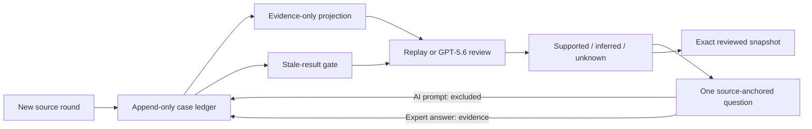

# ObserveOS — The Self-Improving Clinic Operating System

> The breakthrough was not a smarter answer. It was an AI that knew what counted as evidence—and preserved expert corrections so they could improve the next governed run.

ObserveOS is a privacy-safe Build Week prototype of a whole-practice operating system. Its runnable core is the **CaseAgent Reflection Loop**: one synthetic case receives multiple rounds of new information and AI response, while every source, inference, unknown, expert correction, and reviewed snapshot remains traceable.

“Self-improving” here is human-governed, not autonomous self-modification: practitioner corrections become traceable evidence immediately, while new rules, gold cases, and regression tests enter the formal contract only after review.

The demo is intentionally narrow enough to inspect in minutes and deep enough to show the system’s governing idea: **AI output is not automatically truth**.

## What judges can run

- A polished local web app with no third-party runtime packages.
- A four-round fictional case that behaves like a real consultation: provide information, review a response, provide more information, and review again.
- A deterministic replay mode that works without Codex access or model cost.
- A live GPT-5.6 mode that reuses an existing Codex **ChatGPT sign-in**—no OpenAI API key is required.
- An append-only event ledger with a verifiable hash chain.
- A formal-save gate that saves the exact visible reviewed result without a hidden second model call.
- A gold evaluation and 40+ automated contract tests.

## 90-second judge route

1. Start the app with `START_DEMO.cmd` on Windows, or run `python app.py --open-browser`.
2. Leave **Replay** selected and choose **Run evidence replay**.
3. Notice that the first response distinguishes a client report from a practitioner observation and asks one source-anchored question.
4. Choose **Use demo answer**, then **Add answer as evidence**.
5. The visible analysis becomes stale. Run the replay again.
6. Choose **Add round 2: Practitioner observation**, then run the replay again.
7. Repeat through the intervention/retest and next-day follow-up rounds.
8. Inspect **What counts as evidence?** The AI’s questions remain excluded; practitioner answers have provenance.
9. Save the reviewed snapshot only when the gate is ready.

To test the live route, sign into Codex once with `codex login`, select **Codex live**, and run the same workflow. The app checks the existing Codex login; it never asks for or stores an API key.

## Evidence contract

| Layer | Meaning | Can become formal case truth? |
|---|---|---|
| Source | What a person or governed input actually provided | Yes, with provenance |
| Observation | What the practitioner actually recorded | Yes, with provenance |
| Inference | A bounded interpretation derived from cited sources | Only after human review |
| Unknown | Not observed, not tested, or not remembered | Yes—as an explicit unknown |
| AI question | A recall or reflection prompt | No; interaction history only |
| Practitioner answer | The expert’s response to a question | Yes, as new evidence |



The detailed contract is in [docs/EVIDENCE_CONTRACT.md](docs/EVIDENCE_CONTRACT.md).

## Why GPT-5.6 mattered

Earlier work could produce strong bounded outputs when the prompt and source set were already clean. The qualitative shift in this project was architectural: GPT-5.6 helped turn expert corrections into explicit evidence categories, save gates, gold cases, and regression tests. The model was no longer only producing answers; it helped build the mechanism that decides what an answer is allowed to claim.

The development contribution and verifiable Build Week session evidence are described in [docs/BUILD_WEEK_EVIDENCE.md](docs/BUILD_WEEK_EVIDENCE.md).

## Whole-system vision, separate truth layers

ObserveOS can coordinate intake, governed transcription, case reasoning, source-separated knowledge, operations readback, websites and campaigns, and content production. It does **not** merge them into one giant truth bucket. Each domain keeps its own formal source and confirmation boundary; the public prototype implements the reflection loop that governs how evidence crosses into a case output.

See [docs/PRODUCT_LINEAGE.md](docs/PRODUCT_LINEAGE.md) and [docs/ARCHITECTURE.md](docs/ARCHITECTURE.md).

## Requirements

- Python 3.11 or newer.
- A modern browser.
- Optional for live mode: a current Codex CLI authenticated through ChatGPT.

There is no package install step and no `.env` file is needed.

## Start

Windows:

```powershell
.\START_DEMO.ps1
```

Any supported platform:

```bash
python app.py --open-browser
```

The server binds only to `127.0.0.1` by design. Synthetic run history is stored under `runtime_data/`, which is ignored by Git.

## Live Codex mode

```bash
codex login
codex login status
```

The tested ChatGPT account exposed GPT-5.6 through the `gpt-5.6-luna` runtime slug. The launcher tries that route first and only falls back to the documented `gpt-5.6` family slug when the account explicitly rejects the first slug. An exact model can be selected with `OBSERVEOS_CODEX_MODEL`; reasoning effort defaults to `medium` and can be selected with `OBSERVEOS_REASONING_EFFORT`.

The child Codex process is ephemeral, read-only, schema-bound, isolated from repository rules and arbitrary environment secrets, and receives only the fictional evidence projection.

Official references: [Codex authentication](https://learn.chatgpt.com/docs/auth.md), [non-interactive mode](https://learn.chatgpt.com/docs/non-interactive-mode.md), and [`codex exec`](https://learn.chatgpt.com/docs/developer-commands?surface=cli#cli-codex-exec).

## Verify

```bash
python -m unittest discover -s tests -p "test_*.py" -v
python scripts/run_gold_eval.py
python scripts/privacy_audit.py
node --check web/app.js
```

On Windows, `RUN_TESTS.ps1` runs the complete verification set. Results and known limits are recorded in [docs/VERIFICATION.md](docs/VERIFICATION.md).

## Privacy and scope

The repository contains one fictional scenario. It contains no real case, recording, contact, mailbox, operations database, credential, or private source path. Custom entries in the browser are labeled synthetic and remain local. Read [docs/PRIVACY_REVIEW.md](docs/PRIVACY_REVIEW.md) before publishing any derivative.

This prototype supports human review; it is not autonomous diagnosis or medical advice.

## Build Week

- [OpenAI Build Week](https://openai.com/build-week/)
- [Submission portal](https://openai.devpost.com/)
- [Official rules](https://openai.devpost.com/rules)

Released under the [MIT License](LICENSE).
